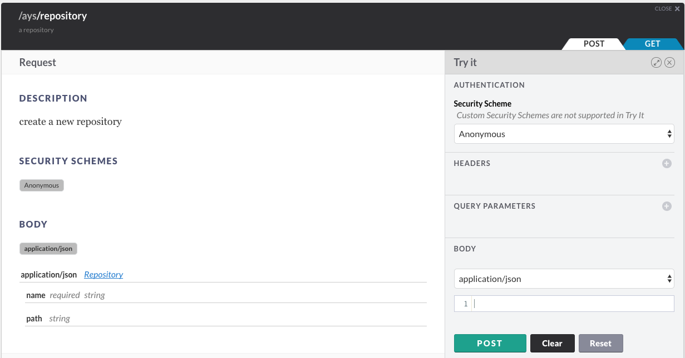

# How to Create a New Repository

You can create an AYS repository in multiple ways:

- [Using the AYS CLI tool](#cli)
- [Using the AYS API](#api)
- [Using JumpScale](#jumpscale)
- [In the Cockpit Portal](#portal)


<a id="cli"></a>
## Using the AYS CLI client

```
REPO_NAME="..."
GIT_URL="https://github.com/<user>/<repository-name>"
ays repo create -n $REPO_NAME -g $GIT_URL
```

As a result a new repository will be created:
```
cd REPO_NAME
```

It contains two empty directories:
- `blueprints`
- `actorTemplates`

Once you add your first blueprint, and execute it, two more directories will be created:

- `actors`
- `services`

See [How to Execute Blueprints](../Execute_blueprint/Execute_blueprint.md) for more details on this.

<a id="api"></a>
## Using the AYS API

In order to use the AYS API you first need to obtain an JWT, as documented in the section about [how to get a JWT](../Get_JWT/Get_JWT.md).

Once you got the JWT:

```bash
JWT="..."
REPO_NAME="..."
GIT_URL="https://github.com/user/reponame"
BASE_URL="<IP-address>"
AYS_PORT="5000"
curl -H "Authorization: bearer $JWT" \
     -H "Content-Type: application/json" \
     -d '{"name":"'$REPO_NAME'", "git_url": "'$GIT_URL'"}' \
     https://$BASE_URL:$AYS_PORT/ays/repository
```

In the **API Console**:



For more information about the **API Console** go to the section about the [API Console](../../API_Console/API_Console.md).


<a id="jumpscale"></a>
## Using the JumpScale client

```python
cl = j.clients.atyourservice.get()
cl.api.ays.listRepositories().json()
cl.api.ays.createRepository()
```


<a id="portal"></a>
## Using the Cockpit Portal

This requires a running instance of the Cockpit Portal.

```python
cuisine = j.tools.cuisine.local
cuisine.solutions.cockpit.install(start=True, branch='8.2.0', reset=True, ip='192.168.196.177')
```

http://192.168.196.177:8200/
